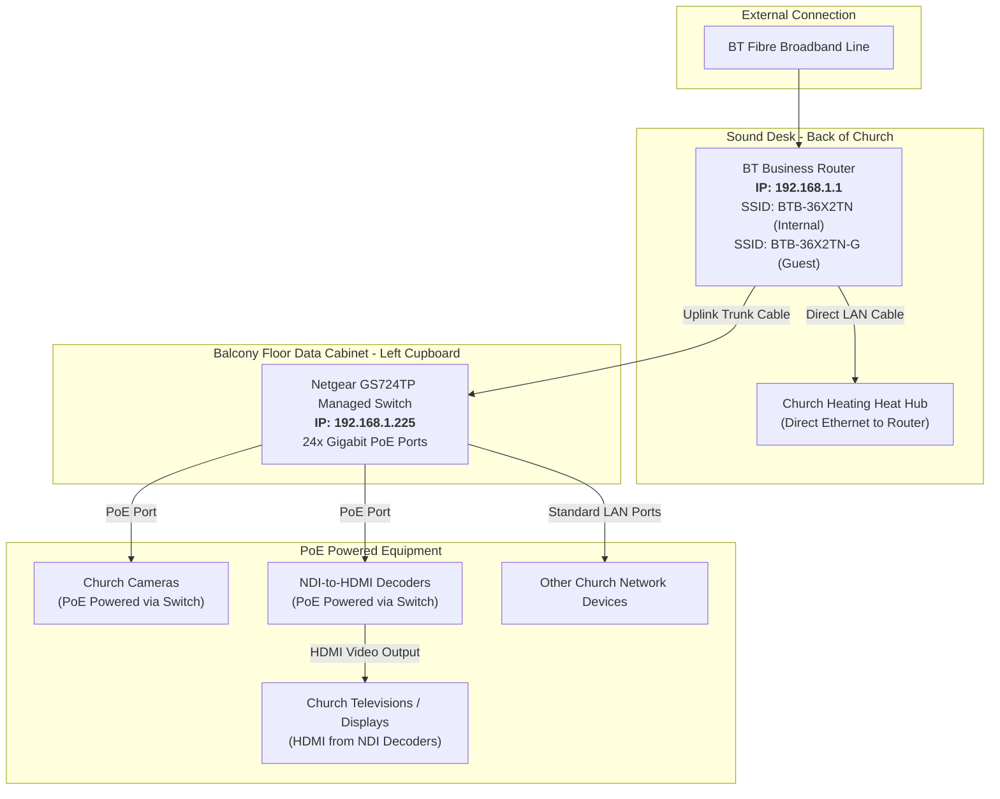

# Church Technical Hardware & Infrastructure Guide
> **Consolidated Hardware Documentation & Configuration Reference**  
> *Compiled from ChurchTech Google Drive Repository (`HARDWARE` &bull; Folder ID: `1krEDbom_uW2JK6nf99sT64bPO_me4Xq9`)*

---

## 📋 Document Metadata

| Attribute | Details |
| :--- | :--- |
| **Document Purpose** | Master reference for core church networking and AV infrastructure |
| **Source Google Drive Folder** | `HARDWARE` (`1krEDbom_uW2JK6nf99sT64bPO_me4Xq9`) |
| **Source Notes Processed** | `Router - note 001`, `Managed switch - note 001`, `Managed switch - note 002` |
| **Note Reconciliation Rule** | Sequential precedence applied (later notes supersede earlier notes) |
| **Last Updated** | September 2026 |
| **Status** | Active & Reconciled |

---

## 📑 Table of Contents

1. [Network Topology & Architecture Overview](#1-network-topology--architecture-overview)
2. [BT Business Fibre Broadband Router](#2-bt-business-fibre-broadband-router)
   - [2.1 Device Overview & Location](#21-device-overview--location)
   - [2.2 IP & Administration Credentials](#22-ip--administration-credentials)
   - [2.3 Physical Port Allocation](#23-physical-port-allocation)
   - [2.4 Wireless Networks (Wi-Fi SSIDs)](#24-wireless-networks-wi-fi-ssids)
3. [Netgear GS724TP 24-Port Managed Switch](#3-netgear-gs724tp-24-port-managed-switch)
   - [3.1 Device Overview & Specifications](#31-device-overview--specifications)
   - [3.2 Physical Location & Cabinet Placement](#32-physical-location--cabinet-placement)
   - [3.3 Web Management Access & Credentials](#33-web-management-access--credentials)
   - [3.4 Power over Ethernet (PoE) & Connected Devices](#34-power-over-ethernet-poe--connected-devices)
4. [Master Quick Reference & Credentials Matrix](#4-master-quick-reference--credentials-matrix)
   - [4.1 Device IP Addressing Table](#41-device-ip-addressing-table)
   - [4.2 Authentication & Passwords Matrix](#42-authentication--passwords-matrix)
   - [4.3 Physical Locations Quick Guide](#43-physical-locations-quick-guide)
5. [Source Notes Audit & Precedence Log](#5-source-notes-audit--precedence-log)

---

## 1. Network Topology & Architecture Overview

The church technology infrastructure relies on a high-speed fibre broadband connection routed through a central BT Business gateway on the sound desk, which connects directly to the heating controller and links upstream to a 24-port PoE managed switch housed in the balcony data cabinet.

The managed switch acts as the central backbone for all video production, stage monitoring, and broadcast distribution.

---

## 2. BT Business Fibre Broadband Router

### 2.1 Device Overview & Location

The primary gateway for church internet access is a dedicated BT Business router providing fibre broadband connectivity across the site.

| Parameter | Specification |
| :--- | :--- |
| **Equipment Type** | Fibre Broadband Gateway / Router |
| **Manufacturer & Model** | BT Business Router |
| **Physical Location** | On top of the sound desk at the back of the church |
| **Primary Function** | Internet gateway, DHCP/routing, heating system uplink, and dual-band Wi-Fi |

> [!NOTE]
> The router is kept accessible on top of the sound desk to allow technicians to quickly monitor connection status indicators and access Wi-Fi coverage across the sanctuary floor.

### 2.2 IP & Administration Credentials

To access the web-based router management portal:

| Setting | Value | Notes |
| :--- | :--- | :--- |
| **Router IP Address** | `192.168.1.1` | Default Gateway for the local subnet |
| **Admin Username** | `admin` | Case-insensitive |
| **Admin Password** | `ugkx7kvx` | **All lowercase letters** |
| **Access URL** | `http://192.168.1.1` | Navigate in standard browser on church network |

> [!IMPORTANT]
> Keep the administrator password secure. The admin password consists strictly of lowercase letters.

### 2.3 Physical Port Allocation

The router maintains minimal direct physical cable connections. Most networked systems across the church run through the central managed switch rather than the router itself.

- **Direct Port 1 (Heating)**: Connected directly to the **Heat Hub** controlling the church heating system.
- **Direct Port 2 (Uplink)**: High-speed Ethernet link connecting to the **Netgear GS724TP Managed Switch** on the balcony.
- **Other Devices**: Routed via the managed switch.

### 2.4 Wireless Networks (Wi-Fi SSIDs)

The router broadcasts two separate wireless networks to segregate church technical equipment from visitors and congregational devices:

| Network Tier | SSID (Network Name) | Wi-Fi Password | Target Devices & Purpose |
| :--- | :--- | :--- | :--- |
| **Internal / Main** | `BTB-36X2TN` | `@Pech!Internal1234@` | Church production computers, sound desk tablet controllers, streaming devices, and internal hardware |
| **Guest Network** | `BTB-36X2TN-G` | `@Pech!Guest1234@` | Visitor mobile phones, guest speakers, and congregation personal devices |

> [!TIP]
> - Both SSIDs are in **all capital letters**.
> - Never connect non-technical guest devices to `BTB-36X2TN` to preserve bandwidth and security for live streams and mixing consoles.

---

## 3. Netgear GS724TP 24-Port Managed Switch

### 3.1 Device Overview & Specifications

The core distribution switch is an enterprise-grade Netgear 24-port managed Gigabit switch with complete Power over Ethernet (PoE) capabilities.

| Parameter | Specification |
| :--- | :--- |
| **Make & Model** | Netgear GS724TP |
| **Switch Class** | Smart Managed Gigabit Ethernet Switch |
| **Total Port Count** | 24 Ports (10/100/1000 Mbps) |
| **PoE Capability** | **All 24 ports support PoE** (Power over Ethernet) |
| **Static IP Address** | `192.168.1.225` |

### 3.2 Physical Location & Cabinet Placement

The switch is securely housed within the church's structural data distribution point:

- **Location**: Balcony floor
- **Enclosure**: Main Data Cabinet
- **Position**: Located inside the **left-hand side cupboard**

### 3.3 Web Management Access & Credentials

Configuration changes, port monitoring, VLAN tagging, and PoE budget management can be accessed via the Netgear web GUI:

| Parameter | Value | Details |
| :--- | :--- | :--- |
| **Management IP** | `192.168.1.225` | Static IP |
| **Web Interface** | `http://192.168.1.225` | Open in any browser on the internal subnet |
| **Username** | `admin` | **All lowercase** |
| **Password** | `@Pech.Stream225@` | Exact case & symbols required |

### 3.4 Power over Ethernet (PoE) & Connected Devices

*(Consolidated from Note 001 and Note 002)*

Every port on the 24-port switch provides native **PoE (Power over Ethernet)**. This eliminates the need for individual power adapters at high and distant mounting positions around the sanctuary.

#### Key Equipment Powered by the Switch:
1. **Church Video Cameras**:
   - PTZ and broadcast cameras positioned in the church are powered directly over Cat6/Ethernet cabling via the switch's PoE ports.
   - Carries both power and control/video data over a single run.
2. **NDI-to-HDMI Decoders**:
   - Decoders attached to television display screens across the church receive DC power directly over the network cables via PoE.
   - Converts IP video streams (NDI) directly into HDMI feeds for audience and stage viewing televisions.
3. **Internal Network Infrastructure**:
   - Distributes high-bandwidth connectivity to remaining hardwired audio/visual tech across the building.

---

## 4. Master Quick Reference & Credentials Matrix

### 4.1 Device IP Addressing Table

| Device Description | Model | IP Address | Subnet Mask | Default Gateway | Physical Location |
| :--- | :--- | :--- | :--- | :--- | :--- |
| **Fibre Broadband Router** | BT Business Router | `192.168.1.1` | `255.255.255.0` | *ISP WAN* | On top of sound desk (back of church) |
| **Core Managed Switch** | Netgear GS724TP | `192.168.1.225` | `255.255.255.0` | `192.168.1.1` | Balcony data cabinet (left cupboard) |
| **Church Heating Controller** | Heat Hub | *DHCP via Router* | `255.255.255.0` | `192.168.1.1` | Plugged directly into BT Router |
| **Production Cameras** | PTZ / Broadcast | *Assigned via Switch* | `255.255.255.0` | `192.168.1.1` | Mounted throughout church (PoE powered) |
| **TV Decoders** | NDI-to-HDMI | *Assigned via Switch* | `255.255.255.0` | `192.168.1.1` | Mounted behind TVs (PoE powered) |

### 4.2 Authentication & Passwords Matrix

> [!CAUTION]
> The following table contains administrative passwords. Restrict access to authorized technicians.

| System / Service | Access Point | Username | Password | Notes |
| :--- | :--- | :--- | :--- | :--- |
| **BT Router Admin** | `http://192.168.1.1` | `admin` | `ugkx7kvx` | All lowercase letters |
| **Internal Wi-Fi** | SSID: `BTB-36X2TN` | *N/A* | `@Pech!Internal1234@` | SSID in all capitals; for tech devices |
| **Guest Wi-Fi** | SSID: `BTB-36X2TN-G` | *N/A* | `@Pech!Guest1234@` | SSID in all capitals; for congregation |
| **Netgear Switch Web GUI** | `http://192.168.1.225` | `admin` | `@Pech.Stream225@` | Username in lowercase; controls PoE & VLANs |

### 4.3 Physical Locations Quick Guide

| Location in Building | Equipment Present | Notes |
| :--- | :--- | :--- |
| **Sound Desk (Back of Church)** | BT Business Router, Heat Hub | Central internet entry point; Wi-Fi broadcast origin |
| **Balcony Floor (Left Cupboard)** | Netgear GS724TP Managed Switch | Inside data cabinet; PoE power injection for cameras & decoders |
| **Sanctuary Pillars / Walls** | Production Cameras | Connected back to balcony switch via Cat-cable |
| **Televisions / Displays** | NDI-to-HDMI Decoders | Powered via PoE from balcony switch; HDMI output into TVs |

---

## 5. Source Notes Audit & Precedence Log

The table below documents the original Google Docs reviewed from Google Drive folder `1krEDbom_uW2JK6nf99sT64bPO_me4Xq9` (`HARDWARE`) and explains how each document was processed according to the note numbering and precedence rules.

| Source Document Title | Google Doc ID | Original Timestamp | Note Index | Content Summary & Integration Decisions |
| :--- | :--- | :--- | :--- | :--- |
| **`Router - note 001`** | `18Lc5-sDMetMNbEj4_hvYlgq9g_Js5o9tQiAJfcTQVdo` | 15/09/2026, 17:47:32 | Note #1 | Established BT Business router details, IP address `192.168.1.1`, admin password `ugkx7kvx`, physical location on sound desk, heat hub direct link, internal Wi-Fi SSID `BTB-36X2TN` with password `@Pech!Internal1234@`, and guest Wi-Fi SSID `BTB-36X2TN-G` with password `@Pech!Guest1234@`. |
| **`Managed switch - note 001`** | `11BbJRY5ljEumhCqtzzfmjjBdJ1q6XsD21xfSm7jur4w` | 15/09/2026, 18:46:28 | Note #1 | Established Netgear GS724TP 24-port switch specifications, static IP `192.168.1.225`, admin username `admin`, password `@Pech.Stream225@`, and location in the balcony floor data cabinet (left-hand side cupboard). |
| **`Managed switch - note 002`** | `1R8YPLTKRXZ5VtqYqJ8OEVUO9e8uXiyXx6agbhLYxllk` | 15/09/2026, 18:48:33 | Note #2 | **Precedence Applied**: Processed sequentially after Note 001. Added critical details that all 24 ports feature PoE capability, specifically powering the production cameras and the television NDI-to-HDMI decoders. No conflicting statements found with Note 001; integrated additively. |

---
*End of Church Technical Hardware Documentation.*
